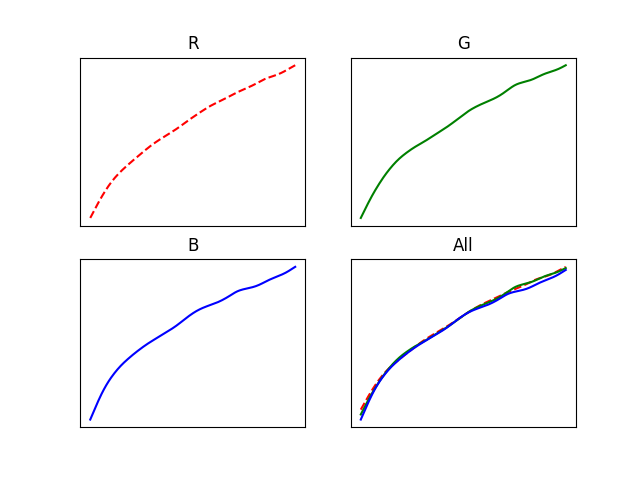
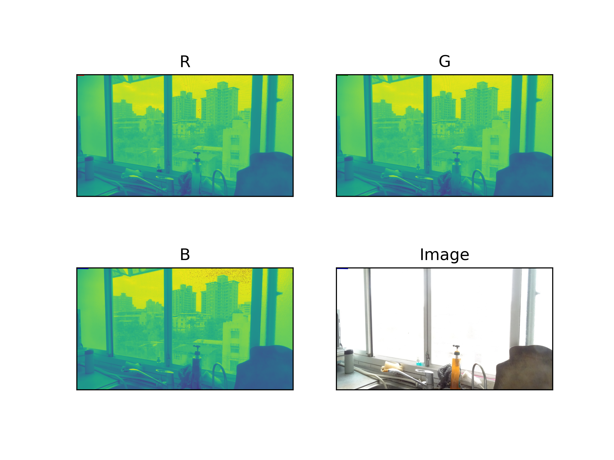
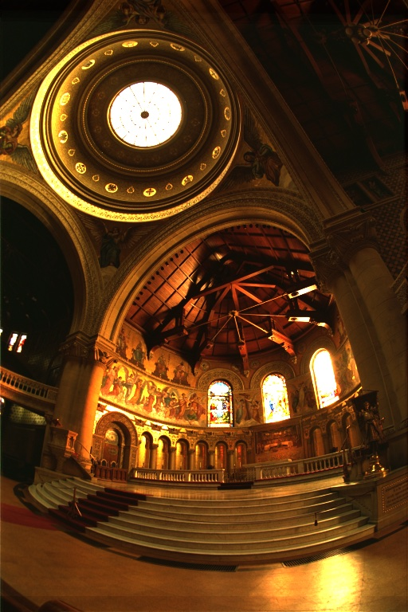
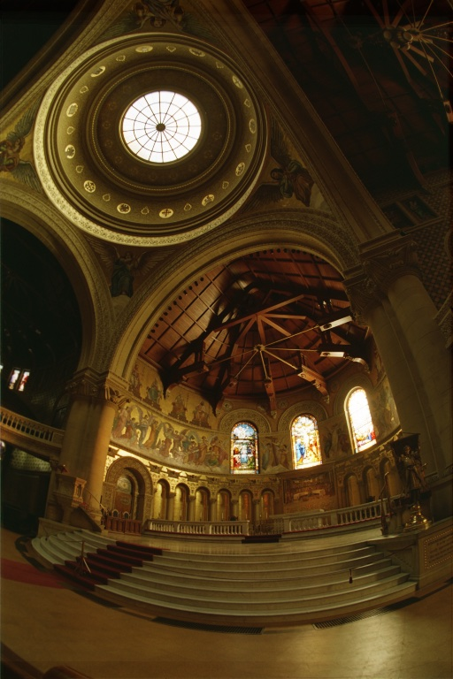
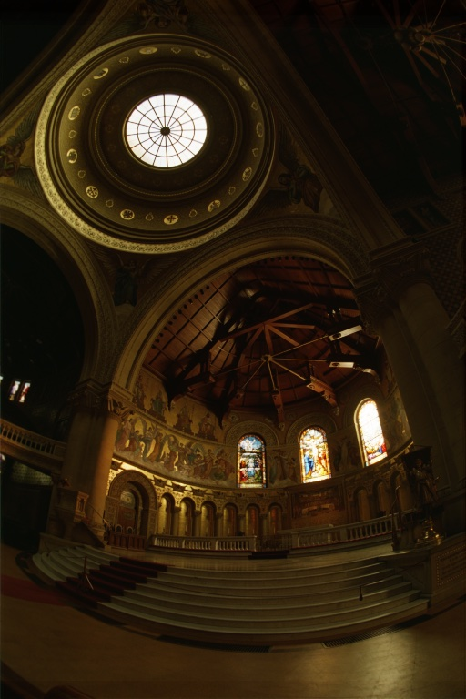

# High Dynamic Range Imaging

### Environment

* Install dependencies
  ```shell
  pip3 install -r requirements.txt
  ```

### Input Format
A folder of images with extensions `.jpg`, `.jpeg`, `.JPG`, `.png` will be loaded as input.
If `ExposureTime` key is not presented in the image's `exif`, image filename will be used for exposure time parsing.
Filename for a `1 / 64` exposure time image should be `1_64.jpg`, with `/` replaced with `_`.
Example for a set of input images could be as following.
```
project_dir
└── samples
    └── data
        ├── 2.jpg
        ├── 1.jpg
        ├── 1_2.jpg
        ├── 1_4.jpg
        ├── 1_16.jpg
        └── 1_64.jpg
```

### Assembling HDR Image
Execute `main.py`.
```shell
python3 main.py --data path/to/images
```

| Arguments             |    Default    | Description                           |
| :-------------------- | :-----------: | :------------------------------------ |
| --data                | samples/data  | input images directory                |
| --align               |       5       | align input images with given scale   |
| --lambda              |      100      | smoothing coefficient                 |
| --sample-num          | 512 / img_num | sample pixel number                   |
| --plot-g              |     True      | plot g function                       |
| --plot-radiance       |     True      | plot radiance map                     |
| --global-photographic |     0.36      | global photographic tone mapping      |
| --gamma-compression   |      1.6      | global gamma compression tone mapping |

This will assemble a HDR image named `raw.hdr`, a plot of g functions in RGB channels `g_plots.png` and
a radiance map `radiance_map.png` in the `outputs` directory.
```
project_dir
└── samples
    └── data
        ├── 1_2.jpg
        ├── 1_4.jpg
        └── outputs
            ├── raw.hdr
            ├── radiance_map.png
            └── g_plots.png
```


### HDR
* **LDR**
  

* **g function**
  

* **Radiance map**
  

* **HDR**
  Tone mapped using Mantiuk `cv2.createTonemapMantiuk(1.3, 0.9, 1.3)`
  

### MTB Image Alignment
* **Before**
  

* **After**
  


### Tone Mapping
* **Raw**
  

* **Global Photographic key =0.18 & key = 0.09**
   

* **Gamma Correction**
   
