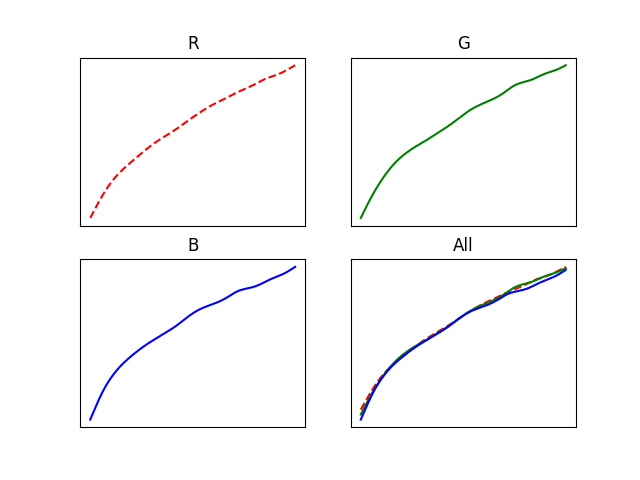
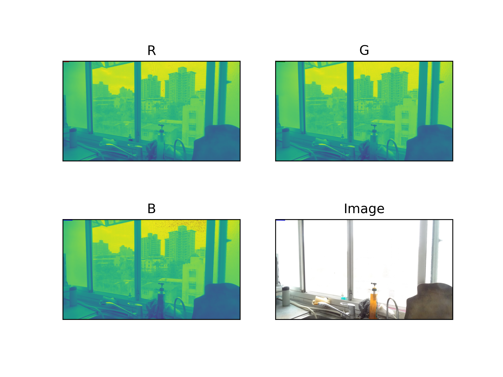
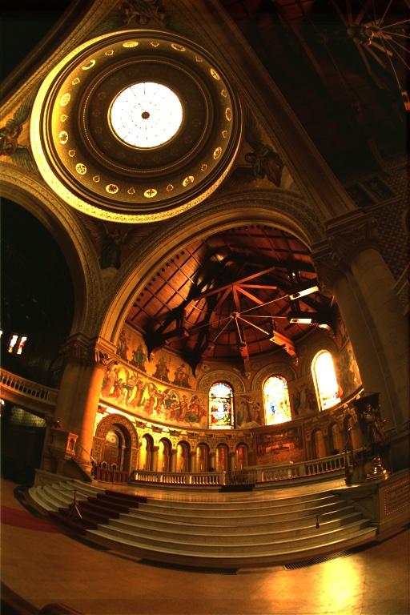
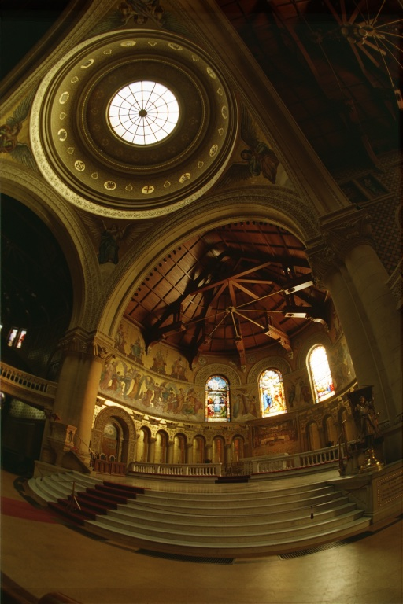
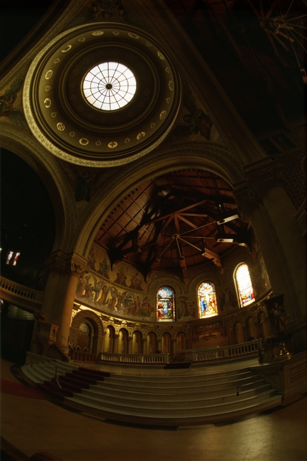
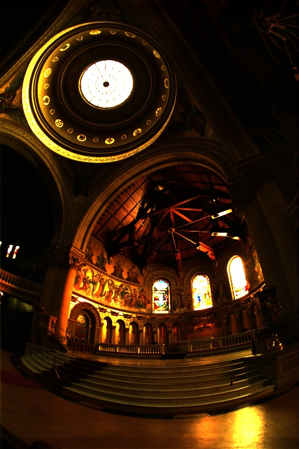
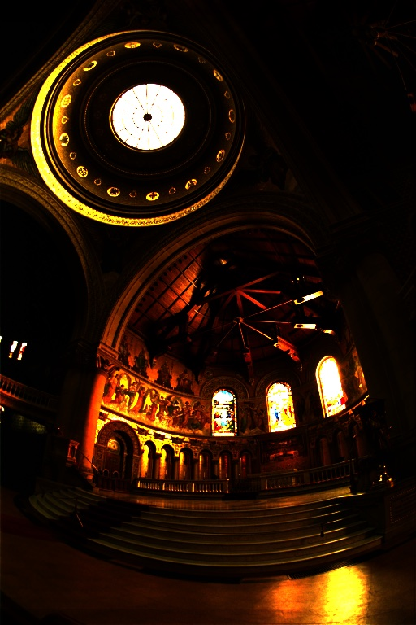

## Project 1: High Dynamic Range Imaging

### 作業分組 30

### 作業內容

#### Main
- [x] **1. Photographs**
- [x] **2. HDR Image assembling**
  - [x] Debevec's Method

#### Bonus
- [x] **3. Tone Mapping (Bonus)**
  - [x] Global Tone Mapping
    - [x] Gamma Correction
    - [x] Photographic
- [x] **4. MTB Image Alignment**

### 實作細節 & 演算法

* 曝光時間
  照片在拍攝後通常會將曝光時間存在 `exif` 的 `ExposureTime`，透過 `pillow` 可以取得曝光  時間。
  如果照片的 `exif` 不存在或是資料有缺失的狀況下，則是透過照片名稱取得曝光時間，因為 `/` 在  名稱中可能會造成問題，所以以 `_` 取代，如曝光時間 `1 / 64` 的照片就以 `1_64` 作為名稱，  作為曝光時間的輸入。

* RGB 分離
  因為在計算 `g` 時會將 RGB 分開來計算，所以在輸入圖片後會將圖片 RGB 分別儲存，轉為以 [RGB, P, width, height] 的形式以方便後續計算

* 在計算 `g` 時，解 Least square 使用的工具是 `numpy` 的 `lstsq`

* MTB image alignment 會將所有輸入的圖片都和 index 位於最中間的圖片對齊，但在輸入的圖片太多時可能會花費很多時間，在測試時同時對齊 10 張照片，並縮放 6 次計算時間還在可接受範圍。這次拍攝時的晃動大致可以縮放 5 次完成對齊，也就是 2^5 - 1 pixels 的位移量。

### 實作結果

#### HDR
* **LDR**
  

* **g function**
  

* **Radiance map**
  

* **HDR**
  Tone mapped using Mantiuk `cv2.createTonemapMantiuk(1.3, 0.9, 1.3)`
  

#### MTB Image Alignment
* **Before**
  

* **After**
  

#### Tone Mapping
* **Raw**
  

* **Global Photographic key =0.18 & key = 0.09**
   

* **Gamma Correction**
   
